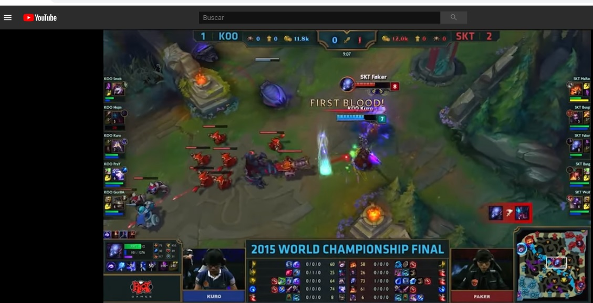
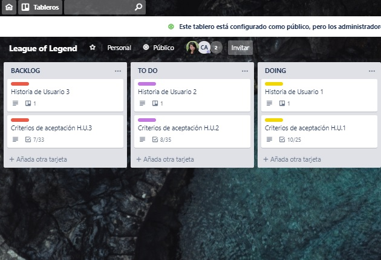
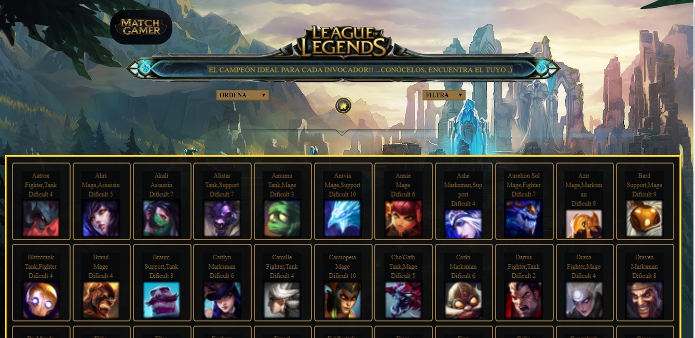

## **MATCH GAMERS**

# *Data Lovers League of Legends*
-------------------------------------------

## **Índice** 
---
* [A-Contexto](#A-Contexto)
* [B-Resumen del proyecto](#B-resumen-del-proyecto)
* [1-Planificación](#1-Planificación)
* [2-Investigación: Radiografía Gamers 🤓](#2-Investigación:-Radiografía-Gamers-🤓)
* [3-¿Cómo son los Gamers Chilenos?](#3-¿Cómo-son-los-Gamers-Chilenos?)
* [4-Recolección de Datos](#4-Recolección-de-Datos)
* [5-Proceso de Diseño](#5-Proceso-de-Diseño)
* [6-MATCH GAMER](6-MATCH-GAMER)

***

## **A-Contexto**
***
League of Legends es un juego competitivo en línea de ritmo frenético, que fusiona la velocidad y la intensidad de la estrategia en tiempo real (ETR) con elementos de juegos de rol. Dos equipos de poderosos campeones, cada uno con un diseño y estilo de juegos únicos, compiten cara a cara a través de diversos campos de batalla y modos de juego. 
Con un plantel de campeones en constante expansión, actualizaciones frecuentes y un emocionante panorama competitivo, League of Legends ofrece posibilidades de juego ilimitadas a usuarios de todos los niveles de habilidad.

***

## **B-Resumen del proyecto**
***
En la Novena generación de Laboratoria SCL, se nos planteó el desafió de hacer  una página web para visualizar un conjunto (set) de datos que se adecúe a lo que descubras que tu usuario necesita.. Para esta ardua tarea comenzamos, planteando las siguientes etapas:

---
---

## **1-Planificación**
- Aplicación de [Trello](https://trello.com/b/Nup1KMh3/league-of-legend)
---
 

- Esquemas, Flujos, Prototipos de Baja Fidelidad. (imágenes)

---
---

## **2-Investigación: Radiografía Gamers 🤓**

***

Comenzamos con una búsqueda online para conocer las aplicaciones disponibles que den información, hay sitios que proporcionan o presentar la información, de realizar búsquedas y filtros  con data relacionada al juego. Más que programas son paginas donde muestran estadísticas de partidas en tiempo real, partidas que ya terminaron y hasta rankings o listas de jugadores con sus KDA o KDA del campeón.
Ejemplo de las más usadas:
- [Lolnexus](http://www.lolnexus.com/)(En ingles, pagina para buscar invocadores y sus estadísticas)
- [Lolking](http://www.lolking.net/)(En Ingles, detalles de otros users,campeones y demás)
- [SalsaLol](http://www.salsalol.com/)(En español, comunidad española de LoL con guias y noticias)
- [Academia-Del-Invocador](http://www.academiadelinvocador.com/)(En español,para mejorar en el juego)
- [Lategame](http://lategame.cl/) (En español, comunidad latina de LOL, con noticias y guías)

---
---

## **3-¿Cómo son los Gamers Chilenos? 🤓** 

***

Están los GAMERS (48% de los encuestados) y los JUGADORES CASUALES (52%) que se diferencian, principalmente, por el tiempo dedicado. Mientras el 35% de los gamers declara jugar más de 20 horas a la semana, los casuales le dedican mayoritariamente entre 5 y 10 horas.
Ambos grupos coinciden en que son predominantemente solteros, menos del 10% tiene hijos y **están entre los 18 y 24 años de edad.** La mitad comenzó a jugar hace más de 10 años y fueron principalmente las figuras familiares, como hermanos o padres, los que los "iniciaron" en este mundo.
**La plataforma favorita para ambos grupos es el PC** pero difieren en su género de videojuegos favorito: mientras los gamers optan por los "shooters" (27%), los jugadores casuales prefieren los RPG (28%).
¿Cuál es el impacto positivo que han traído los videojuegos a sus vidas? Entretención, la posibilidad de conocer amigos (más de 67% de los gamers juega con amigos o familiares online) y una forma de relajo, son los elementos que más valoran. Sin duda, **se despeja la hipótesis de que los gamers juegan en forma solitaria.**
(imagen grafico)
Otro punto importante es que una amplia mayoría de los encuestados respondió que son ellos mismos quienes compran los juegos (79% gamers y 73% jugadores casuales). Más atrás quedó el porcentaje (35% gamer y 37% jugadores ocasionales). El resto se reparte entre quienes reciben sus juegos comprados por hermanos, otra persona o un amigo.
En resumen, podemos concluir que tanto los gamers como los jugadores ocasionales,**distan mucho de la imagen que los asocia como "personas aisladas".**

( Referencias de Investigación: GFK.)

---
---

## **4-Recolección de Datos**

***

**Consideraciones:**
- ¿Quién es el usuario? 
- ¿Cuáles son los objetivos del usuario en relación con la appWeb?
- ¿Cuáles son los datos relevantes que quiere ver el usuario y por qué?
- ¿Cuándo utilizaría la appWeb?

**Entrevista Tipo: Usuario testeado:**

---

-Datos usuario;
 Edad: 20, hombre.

-¿Juegas LoL ? y ¿ con qué frecuencia u horarios, ? 
Algunas veces a la semana, teniendo tiempo. Ya que una partida puede durar minimo 30 min.

-¿Nivel de jugador Básico, medio, avanzado?
 Principiante, medio.

-¿Qué información necesitarían y por qué que les entregara la app.?
Para principiantes y medio avanzados, sería como guía, ver la Colección antes de la selección de campeones. (Mostrar data)
. Ver categorías o tipo: (Filtrar)
1-Tank: top (arriba)
2-Figther: Jungla
3-Magic: Mago
4-Tirador: ADC(abajo)
5-Soporte

-¿Cuándo  o en qué situación  usarían la app.?
 Podría ser antes o durante el juego para ver habilidades o características de los campeones, para usar durante el juego al armar equipos.

Observaciones y otros:
Importante agregar Aspectos  y el tema visual de la app.Texto acotado, sólo lo relevante.

---
---

## **5-Proceso de Diseño**
***

**Definición del usuario:**
***

- Jugadores de LOL, principiantes principalmente. 
- Hombres y mujeres de 17 a 27 años.
- Que utilizarían la app. web antes o mientras juegan una partida de LOL.
- Con el objetivo de obtener información sobre campeones,  para "Mejorar desempeño como jugador".Ya que  como estrategas deben formar el mejor equipo de campeones para enfrentarse con otros equipos.

---
**Definición de la Problemática:** &#128559;
---
---
**" Encontrar el campeón ideal para la batalla, y así ganar con la mejor estrategia."**

Sobre lo investigado; los usuarios a los que este proyecto va dirigido son aquellos jugadores de videojuegos (gamers) o personas que se inician en el mundo de “League of Legends” y quieren conocer más de los campeones para hacer la mejor elección.

**Conclusiones**
---

En resumen, el tipo usuario entrevistado es un jugador principiante de League of Legends, conoce el juego desde hace mucho tiempo, pero se considera aun relativamente nuevo. 
Durante la entrevista con el usuario se destacan: la diversidad de campeones que se pueden usar en el juego. 
La cantidad, ya que al ser cientos de personajes se hace complicado para un jugador principiante el poder reconocerlos y asociarlos con sus roles, dificultad, etc. 
Por lo que se hace importante para necesidad de nuestro usuario:
•	Si pudiese visualizar la información concisa de los campeones (nombres e imágenes)
•	Si pudiese ordenar por la dificultad de uso de cada uno.
•	Si pudiese ver los tipos/roles que cumplen cada campeón.
•   Y quizás de manera secundaria información extra como los puntos de vida y de maná de cada campeón por niveles, ya que esto le facilitaría desarrollarse         mejor en las partidas.

**HISTORIAS DE USUARIOS**
---
***
1.	Yo como usuario quiero poder ver a todos los campeones con sus nombres e imágenes para poder diferenciarlos.
2.	Yo como usuario quiero poder ordenar la lista de los campeones para poder verlos alfabéticamente o por debilidad, ya que con esta información puedo decidir con qué personaje comenzar a jugar.
3.	Yo como usuario quiero poder filtrar a los campeones por sus roles para poder identificarlos mejor.
4.	Yo como usuario quiero poder ver qué cantidad de los campeones juega en cada rol para poder saber con qué categoría tengo mas opciones.

### IDEACIÓN Y PROTOTIPADO
***
#### Prototipo de baja fidelidad

Test Usabilidad
Diseño de experiencia de usuario (UX):
•	Prototipado (sketching)
•	Testeo e Iteración 

(sketches (boceto) de tu
solución usando papel y lápiz. 
fotos de todas las iteraciones que realices)
[Figma](https://www.figma.com/) 

#### Prototipo de alta fidelidad

 Test Usabilidad
Diseño de experiencia de usuario (UX):
•	Prototipado 
•	Testeo e Iteración 

(Test de Usabilidad, fotos de todas las iteraciones que realices)
[Zeplin](https://zeplin.io/)

---
---
## **6-MATCH GAMER**
---
***

**QUÉ ES? 😯**
--
Web app., para jugadores de [League of Legend](https://las.leagueoflegends.com/es/) 

Aplicación web que interactúe con el usuario a través del navegador y la lógica basada en esa interacción que servirá para que el usuario pueda ver los perfiles y acceder a la data relacionada con los personajes de la interfaz del juego, llamados "Campeones".

Dentro de esta información están los rasgos más básicos para cada campeón. 
Imagen, Nombre, Rol, Dificultad, etc.

**Su funcionalidad**
---
**"La idea es que cada jugador(Invocador), pueda hacer  match con el campeón que más le interese para su estrategia en la partida de LOL."**

 

El objetivo de la webApp es ser una herramientas que ayude en el proceso de busqueda de información y elección de los campeones.
Considerando esta via a futuro, también bajo una temática lúdica, para poder interactuar quizas con otros jugadores y aprovechar la informacion entregada por los perfiles, roles, etc. ya que a traves de los mismos con gustos y caracteristicas de los campeones se pueden generar patrones y similitudes con otros jugadores de Lol.

**La interfaz permite al usuario:**
--
- Ver la Data.
- Ordenar la Data Alfabeticamente.
- Ordenar la Data por Dificultad.
- Filtrar la Data por Roles.
- Ver el calculo de la cantidad de campeones por Rol al filtrar.

**Links relacionados**
--
- Readme Proyecto : https://gabagonzalez.github.io/SCL009-data-lovers
- Código: https://gabagonzalez.github.io/SCL009-data-lovers/src/index.html
- Trello: https://trello.com/b/Nup1KMh3/league-of-legen

